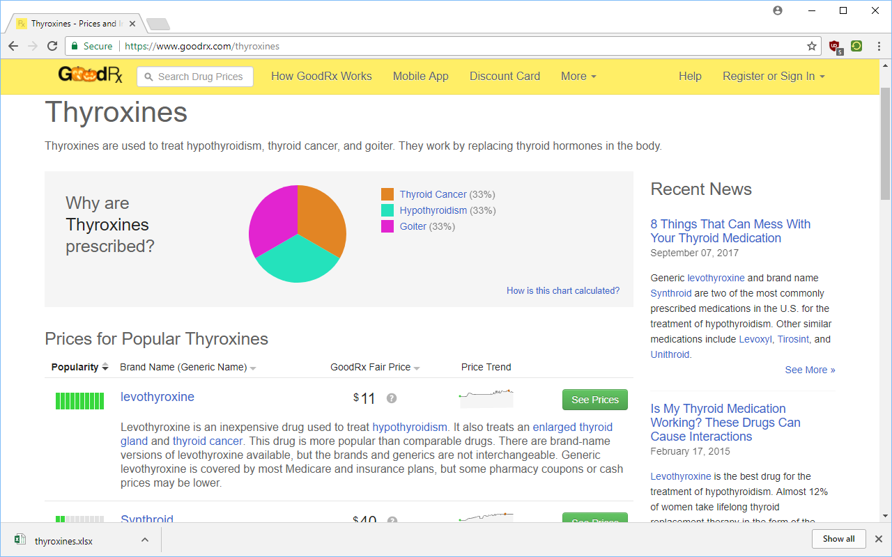

# RxHistory

Download a spreadsheet with pricing history for drugs in a drug class on the
popular prescription price comparison site, goodrx.com!

This Chrome extension supports any number of drugs, and processes prices
automatically.

Each drug is on a separate sheet in the spreadsheet, downloads are in XLSX
(Excel) format. Prices are all given in USD ($). Dates are in international
format, year-month-day (YYYY-MM-DD, ex: 2017-01-27).

**Author**: Adel Qalieh

**License**: [GPLv3](license.txt)

**Download**: [Chrome Web Store](https://chrome.google.com/webstore/detail/rxhistory/nhblpgnkmlajcpfbddnjpnlnplmdldml)

## Usage

Using this Chrome extension is quite simple. On drug class pages on goodrx.com,
the icon in the upper left of Chrome will become green indicating that the
Chrome extension is active.

Simply press on the RxHistory icon while it is active, and a spreadsheet
containing the price history will be immediately downloaded.

## Developing

To download required JS libraries, use the Makefile:

    make js

Then, install the Chrome extension in Chrome at chrome://extensions using
Developer mode to load an unpacked extension.
